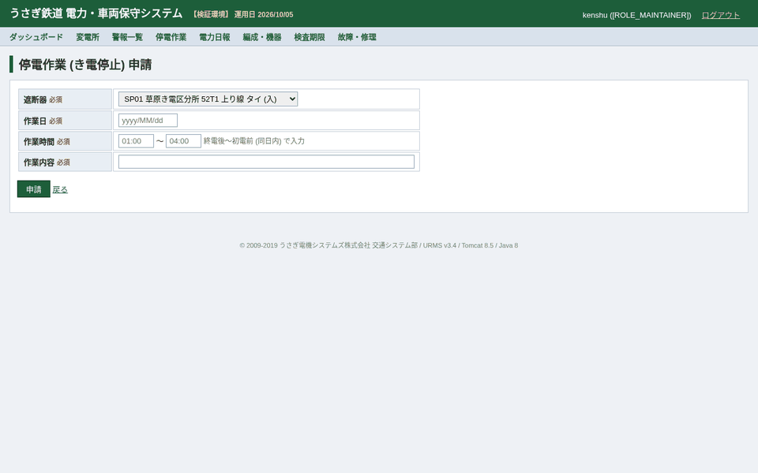
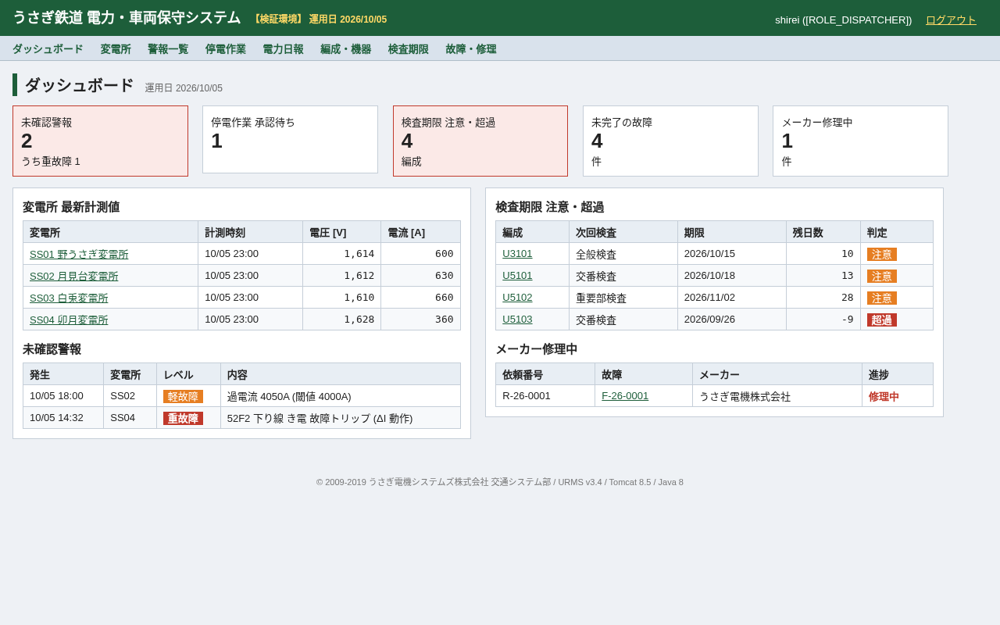
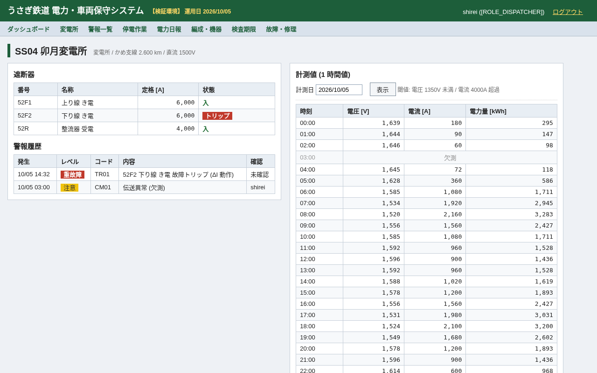
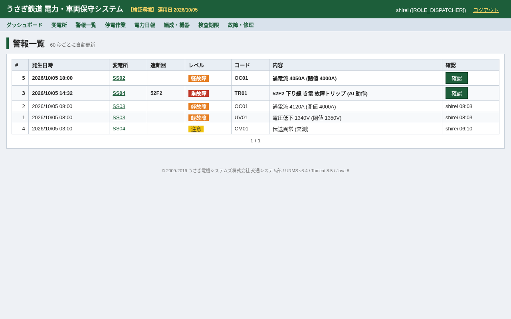
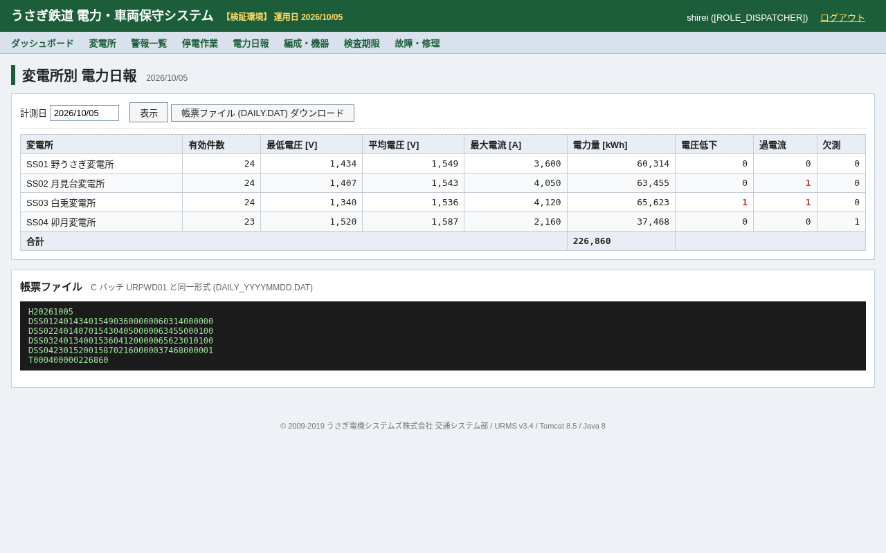
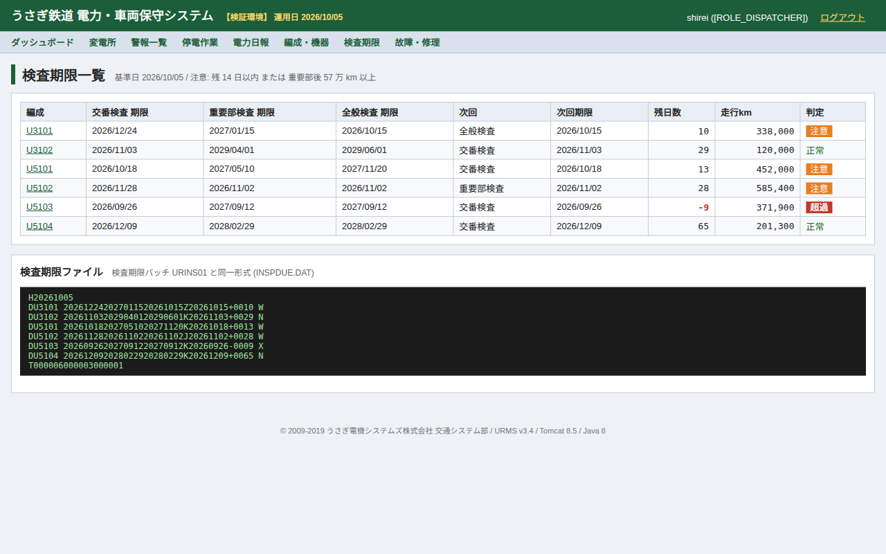
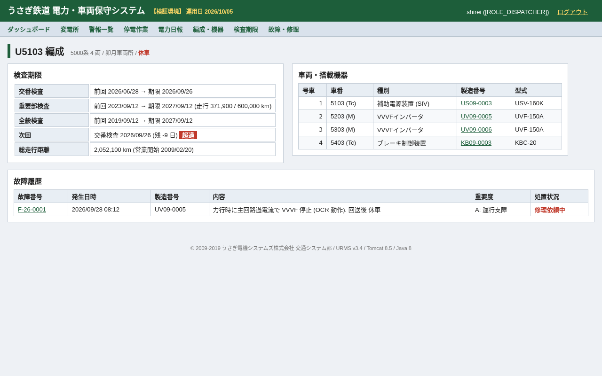
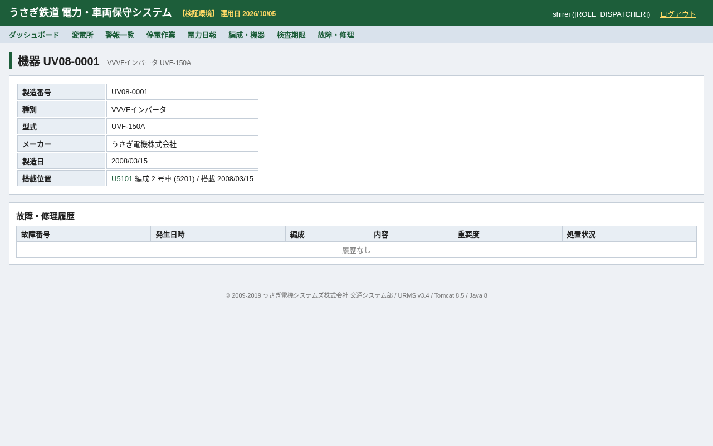
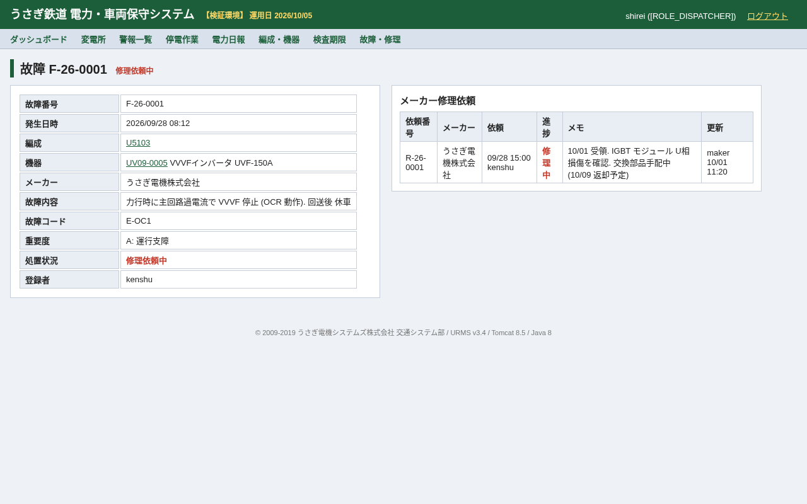

# うさぎ鉄道 電力・車両保守システム (URMS)

**うさぎ鉄道 (架空の鉄道事業者) の電力管理・車両保守システムです。** 電力指令所と検修庫で使う社内 Web アプリで、変電所・き電区分所の遮断器状態と計測値の監視、警報の確認、停電作業 (き電停止) の申請から承認・復電までを扱います。車両側では編成・車両・搭載機器を製造番号で管理し、故障記録、メーカーへの修理依頼と進捗、交番・重要部・全般検査の期限を管理します。夜間バッチは C (電力日報) と Java (検査期限) で書かれています。

移行・モダナイゼーションのデモ対象として、あえて*レガシー*な構成にしています: **Spring Boot 1.5.22 / Java 8 / JSP + jQuery 1.12 / JUnit 4 / H2 上の Oracle 方言 SQL / Flyway 4 / Ehcache 2 / Joda-Time / C (gcc) の夜間バッチ / Jenkinsfile (WebSphere デプロイ)**。

> 架空のシステムです。三菱電機を含む実在企業のシステムやデータを再現したものではありません。



| ダッシュボード | 変電所 (遮断器・計測値) | 警報一覧 |
|---|---|---|
|  |  |  |

| 電力日報 (C バッチと同一形式) | 検査期限 (検査期限バッチと同一形式) | 編成 (休車・検査超過) |
|---|---|---|
|  |  |  |

| 搭載機器 (製造番号のライフサイクル) | 故障・メーカー修理 |
|---|---|
|  |  |

## 業務機能

| 区分 | 画面 / API | 内容 |
|---|---|---|
| 電力管理 | ダッシュボード | 未確認警報, 停電作業の承認待ち, 検査期限 注意・超過, メーカー修理中 |
| | 変電所 | 変電所 / き電区分所, 遮断器 (入・切・トリップ), 1 時間値 (電圧・電流・電力量), 閾値超過の強調 |
| | 警報一覧 | 重故障・軽故障・注意, 指令員による確認, 60 秒自動更新 |
| | 停電作業 | 申請 (検修) → 承認 / 却下 (指令) → き電停止 (遮断器 切) → 復電 (遮断器 入). 同一遮断器・同日の重複申請やトリップ中の遮断器操作は不可 |
| | 電力日報 | 変電所別の最低・平均電圧, 最大電流, 電力量, 電圧低下 / 過電流 / 欠測回数. C バッチ `URPWD01` と同一形式の `DAILY_YYYYMMDD.DAT` |
| | 計測伝文受信 | `POST /api/telemetry` (RTU, 固定長 H/D/T, トレーラ件数照合, 閾値判定で警報発生) |
| 車両保守 | 編成・機器 | 編成・車両・搭載機器 (VVVF, SIV, 主電動機, ブレーキ制御, 空調…), 製造番号でのライフサイクル追跡, 予備品 |
| | 故障・修理 | 故障登録 (製造番号から搭載位置を自動特定, 重要度 A は自動で休車), 調査, メーカー修理依頼, メーカーによる進捗更新, 完了 |
| | 検査期限 | 交番 (90 日), 重要部 (4 年 or 60 万 km), 全般 (8 年). 残 14 日以内 / 57 万 km 以上で注意. 検査期限バッチ `URINS01` (`batch/java/`) と同一形式の `INSPDUE.DAT` |

REST API (`/urms/api/**`, HTTP Basic): `GET /api/substations`, `GET /api/substations/{code}`, `GET /api/alarms?unacked=true`, `POST /api/telemetry`, `GET /api/formations`, `GET /api/formations/{no}`, `GET /api/equipment/{serial}`, `GET|POST /api/failures`。管理者のみ: `GET /api/batch/daily-report?date=yyyyMMdd`, `GET /api/batch/formations-file`, `GET /api/batch/inspection-due`。

## 起動方法

必要なもの: JDK 8、Maven 3.x (C バッチを動かす場合は gcc)。

```bash
JAVA_HOME=/usr/lib/jvm/java-8-openjdk-amd64 mvn spring-boot:run
# → http://localhost:8080/urms/
```

デモユーザ (インメモリ, `SecurityConfig`):

| ユーザ | パスワード | ロール | できること |
|---|---|---|---|
| `shirei` | `shirei123` | DISPATCHER (電力指令) | 警報確認, 停電作業の承認・却下・き電停止・復電 |
| `kenshu` | `kenshu123` | MAINTAINER (検修) | 停電作業申請, 故障登録, メーカー修理依頼 |
| `maker`  | `maker123`  | MAKER (機器メーカー) | 車両保守の照会, 修理進捗の更新 (電力系は不可) |
| `rtu`    | `rtu123`    | RTU (伝送装置) | 計測伝文の送信 (API のみ) |
| `admin`  | `admin123`  | ADMIN + DISPATCHER + MAINTAINER | 全機能, バッチ API, DB コンソール |

運用日は `urms.operation-date=2026/10/05` で固定しています (デモの再現性のため)。H2 コンソール `/urms/h2-console` (JDBC URL `jdbc:h2:mem:urms`, ユーザ `URMS` / `urms`)、Actuator `/urms/manage/health`。

```bash
curl -u shirei:shirei123 http://localhost:8080/urms/api/substations/SS04
printf 'H20261006\nDSS0108000138004200000580001\nT000001\n' | \
  curl -u rtu:rtu123 -H 'Content-Type: text/plain' --data-binary @- http://localhost:8080/urms/api/telemetry
curl -u admin:admin123 "http://localhost:8080/urms/api/batch/daily-report?date=20261005"
```

## テスト

```bash
JAVA_HOME=/usr/lib/jvm/java-8-openjdk-amd64 mvn test   # 66 件 (JUnit 4, SpringRunner, H2 Oracle モード)
batch/c/run.sh                                           # URPWD01 をビルド・実行し expected/DAILY_20261005.DAT と比較
batch/java/run.sh                                        # URINS01 Java 版を WAR から起動し expected/INSPDUE.DAT と比較
```

| テスト | 検証内容 |
|---|---|
| `CBatchParityTest` | Java の電力日報集計と C `URPWD01` の出力が 1 バイト単位で一致すること |
| `CobolParityTest` | Java の検査期限算出と旧 COBOL 版 `URINS01` の出力 (`golden/INSPDUE_COBOL.DAT`) が 1 バイト単位で一致すること |
| `Urins01BatchTest` | Java 版 `URINS01` (`Urins01Batch`) のファイル入出力, RC (0/4/8/12), コンソールメッセージ |
| `Urins01BoundaryParityTest` | 境界値 19 ケース (`golden/boundary/`) で Java 版 `URINS01` の RC・出力ファイル・標準出力が旧 COBOL 版と一致すること |
| `InspectionServiceTest` | 検査周期, 注意・超過判定, 走行 km, うるう日 (2100/02/28) |
| `TelemetryFileTest` | 固定長伝文 (H/D/T) の解析, トレーラ件数照合 |
| `OutageServiceIT` | 停電作業の状態遷移, 遮断器の切/入, 重複申請, トリップ中の操作禁止 |
| `FailureServiceIT` | 故障登録, 重要度 A の休車, 予備品, 修理進捗の逆戻り禁止, 修理中の完了禁止 |
| `UrmsApiIT` | API の認証・ロール別認可, 計測伝文の受信と警報発生, エラーコード (`UR-xxxx`) |
| `WebSecurityIT` | 画面フォーム POST のサーバ側ロール制御 (指令 / 検修 / メーカー), CSRF |

ゴールデンファイル (`src/test/resources/golden/`) のうち電力日報は `batch/c/data` と `batch/c/expected` のコピーです。C バッチ側を変えたら両方を更新してください。検査期限 (`FORMATIONS.DAT`, `INSPDUE_COBOL.DAT`, `boundary/`) は退役前の COBOL 版 `URINS01` の出力を記録した移行の契約なので変更しないでください (`batch/java/data`・`batch/java/expected` も同じ内容です)。

## リポジトリ構成

```
pom.xml                          Spring Boot 1.5.22 親 POM, WAR パッケージ, Java 1.8
Jenkinsfile                      Jenkins 2.x 宣言型パイプライン (WebSphere ステージング, バッチサーバへ配布)
src/main/java/jp/usagi/railway/
  config/                        SecurityConfig (WebSecurityConfigurerAdapter × 2), WebMvcConfig, AuditLogFilter
  domain/                        JPA エンティティ: Substation, Breaker, Measurement, Alarm, OutageRequest,
                                 Formation, Car, Equipment, FailureRecord, RepairOrder + 列挙型
  repository/                    Spring Data JPA + 文字列連結の動的 JPQL (FailureRecordRepositoryImpl) + ROWNUM ネイティブ SQL
  service/                       Telemetry / Alarm / DailyReport / Outage / Inspection / Failure ほか
  web/                           JSP コントローラ (ダッシュボード, 電力, 停電作業, 車両, 故障)
  api/                           REST コントローラ + DTO + ApiExceptionHandler (UR-xxxx エラーコード)
src/main/resources/db/migration  Flyway 4: V1 スキーマ (Oracle DDL 方言), V2 初期データ
src/main/webapp/WEB-INF/jsp      JSP/JSTL 画面 (日本語 UI) + jQuery 1.12.4
batch/c/urpwd01.c                C 電力日報バッチ (2004 年製), data/, expected/, run.sh
batch/java/urins01               Java 版 URINS01 検査期限算出バッチの起動ラッパー (WAR 内の Urins01Batch), data/, expected/, run.sh
demo/reset.sh                    デモ環境リセット
docs/DEMO.md                     デモ台本
docs/images/                     README 用スクリーンショット / GIF
```

## モダナイゼーションのトラック (デモシナリオ)

| トラック | 改修ポイント |
|---|---|
| 1. Spring Boot 1.5 / Java 8 → 3.x / 21 | `javax.*` → `jakarta.*`, `WebSecurityConfigurerAdapter`, `antMatchers`, `findOne`, `new PageRequest`, `org.hibernate.validator.constraints.NotBlank`, Flyway 4 / H2 1.4 / Ehcache 2, `server.context-path` などの旧プロパティ, JUnit 4, Joda-Time |
| 2. C バッチ → Java | `batch/c/urpwd01.c` ⇔ `DailyReportService`. `CBatchParityTest` が契約 |
| 3. COBOL バッチ → Java (移行済み) | 旧 COBOL 版 `URINS01.cbl` (コミット `745a86d` まで) → `Urins01Batch` + `InspectionService`. 仕様は [docs/batch/URINS01.md](docs/batch/URINS01.md), `CobolParityTest` / `Urins01BoundaryParityTest` が契約 |
| 4. JSP / jQuery → React / TypeScript | JSP 17 枚. 同じ操作は REST API でも提供済み. jQuery の挙動 (全角正規化, 製造番号照会, 確認ダイアログ, ソート, 自動更新) は `static/js/urms.js` |
| 5. Oracle → PostgreSQL | `VARCHAR2`, `NUMBER`, シーケンス (`SEQ_*.NEXTVAL`), `ROWNUM` を使ったネイティブ SQL, H2 `MODE=Oracle` |
| 6. Jenkins → GitHub Actions | `Jenkinsfile` (WebSphere `wsadmin`, Nexus, SonarQube 5.6, バッチ配布) |

保守改修 (閾値の変電所別設定など) の題材と台本は [docs/DEMO.md](docs/DEMO.md) を参照してください。

## 注意
架空のデータを使ったデモシステムです。認証情報はインメモリのデモ用の値のみです。
